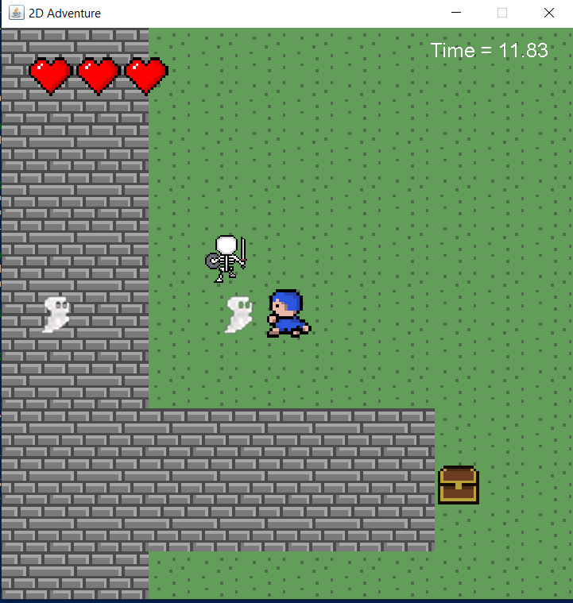

- # Balade dans un labyrinthe

  L’objectif de ce projet est la réalisation d’un jeu mono-utilisateur avec une interface 
  graphique. Le jeu consiste à déplacer un personnage dans un labyrinthe dans le but de 
  découvrir un trésor. Dans le labyrinthe, il peut y avoir des monstres de différents types qui 
  essayent d’attaquer le personnage.

  

  ## Pour exécuter le jeu : 

  - Cloner le répertoire du jeu

  - Ouvrez votre terminal.

  - Naviguez jusqu'au répertoire de votre projet où se trouve le fichier `pom.xml`.

  - Exécutez la commande suivante pour nettoyer et empaqueter le projet :
  
  ```bash
  mvn clean package
  java -jar target/ACL_Game-0.0.1-SNAPSHOT.jar
  ```

## Comment jouer :

- Pour bouger le hero, utiliser les boutons Z,S,Q,D ou les flèches.

