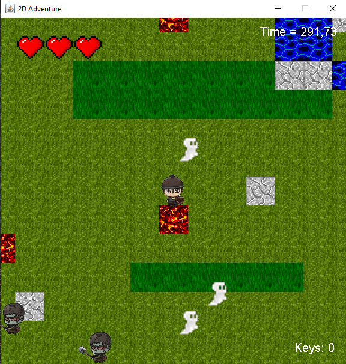

- # Balade dans un labyrinthe

  Le but de ce projet est de créer un jeu où le joueur incarne un héros évoluant dans un labyrinthe. L’objectif principal est de collecter des clés pour accéder à des niveaux supérieurs. Cependant, le parcours est semé d’embûches : des monstres et des fantômes tenteront de bloquer sa progression.


  

  ## Pour exécuter le jeu : 

  - Cloner le répertoire du jeu

  - Ouvrez votre terminal.

  - Naviguez jusqu'au répertoire de votre projet où se trouve le fichier `pom.xml`.

  - Exécutez la commande suivante pour nettoyer et empaqueter le projet :
  
  ```bash
  git clone https://github.com/uzi-belfayez/ACL_Project
  cd ACL_Project
  mvn clean package
  java -jar target/ACL_Game-0.0.1-SNAPSHOT.jar
  ```

## Comment jouer :

- Le héros se déplace grâce aux touches fléchées du clavier. Pour se défendre, il peut attaquer à l'épée en appuyant sur la barre d’espace et lancer des boules de feu redoutables avec la touche 'E'.

